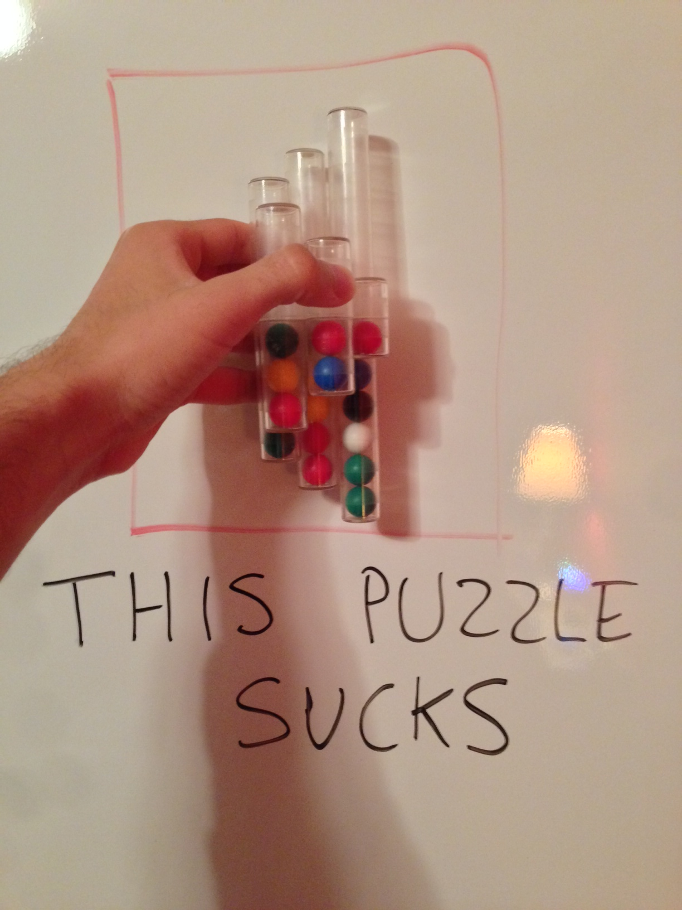

# Goal

My goal is to programmatically solve the "SixStair" puzzle (picture below). I first attempted to write the [solver in Dart](old/dart_attempt), then I completed a solver in [C++](old/SixStairSolver).

Currently, I am attempting to rewrite the solver in Go.

# Picture

Here is the puzzle in all its glory:

